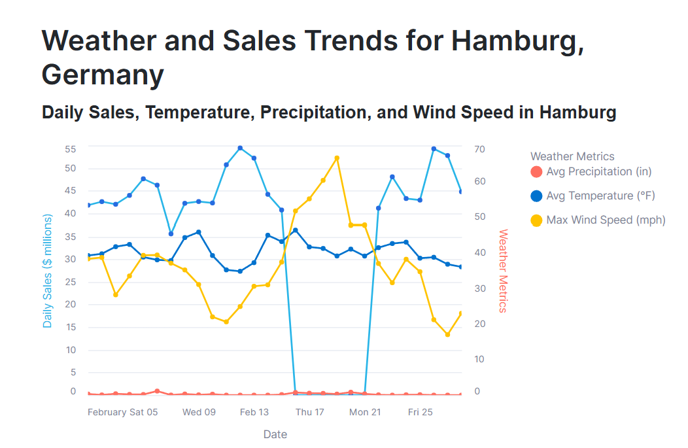

# Sales Investigation Snowflake Pipeline

An end-to-end Snowflake data pipeline for investigating a sales anomaly: sales in
Hamburg, Germany dropped to `$0` for several days in February.

The project is organized around the **Ingestion–Transformation–Delivery (I-T-D)**
framework:

```text
Snowflake Marketplace ─┐
                       ├─> Raw data ─> SQL/Python transformations ─> Curated data ─> Streamlit in Snowflake
AWS S3 ────────────────┘
```

> **Repository status:** this repository currently contains the project
> documentation only. The SQL, Python, and Streamlit objects described below are
> the implementation blueprint for the pipeline and should be added as the
> project is built.

## What this project demonstrates

- Snowflake as the platform for data engineering and analytics
- Data sharing through the Snowflake Marketplace
- Loading files from AWS S3 blob storage
- A layered ingestion, transformation, and delivery architecture
- Transformations using SQL, views, Python UDFs, and stored procedures
- A final investigation product delivered with Streamlit in Snowflake

## I-T-D architecture

### 1. Ingestion

The pipeline brings together two complementary sources:

| Source | Typical role | Snowflake integration |
| --- | --- | --- |
| Snowflake Marketplace | Shared reference, demographic, geographic, or economic data used to explain sales patterns | Secure data share, database, and schema |
| AWS S3 | Project sales files and other event-level extracts | Storage integration, external stage, file format, and `COPY INTO` |

Keep ingested data immutable and close to its source. A typical database layout is:

```text
SALES_DB
├── RAW          -- source-shaped tables loaded from S3
├── MARKETPLACE  -- objects exposed by the Marketplace share
├── TRANSFORMED  -- cleaned and modeled views/tables
└── ANALYTICS    -- objects consumed by Streamlit
```

#### Marketplace data sharing

After obtaining a Marketplace listing, create or select the shared database using
the provider's instructions. Marketplace data is shared into the consumer account;
it should not be copied unnecessarily.

```sql
-- The exact database and schema names depend on the listing.
SHOW DATABASES;
SHOW SCHEMAS IN DATABASE <MARKETPLACE_DATABASE>;
SHOW TABLES IN SCHEMA <MARKETPLACE_DATABASE>.<MARKETPLACE_SCHEMA>;
```

Use the shared objects through documented contracts and grant the least
privilege required by the pipeline role.

#### Loading AWS S3 data

The exact bucket URL, file format, and AWS role are environment-specific and must
be supplied through account configuration rather than committed to the
repository.

```sql
CREATE OR REPLACE FILE FORMAT SALES_DB.RAW.SALES_CSV_FORMAT
  TYPE = CSV
  SKIP_HEADER = 1
  FIELD_OPTIONALLY_ENCLOSED_BY = '"'
  NULL_IF = ('', 'NULL');

CREATE OR REPLACE STAGE SALES_DB.RAW.SALES_S3_STAGE
  URL = 's3://<bucket>/<prefix>/'
  STORAGE_INTEGRATION = <S3_STORAGE_INTEGRATION>
  FILE_FORMAT = SALES_DB.RAW.SALES_CSV_FORMAT;

CREATE OR REPLACE TABLE SALES_DB.RAW.SALES (
  order_id       VARCHAR,
  order_date     DATE,
  city           VARCHAR,
  country        VARCHAR,
  product_id     VARCHAR,
  quantity       NUMBER,
  unit_price     NUMBER(18, 2),
  loaded_at      TIMESTAMP_NTZ DEFAULT CURRENT_TIMESTAMP()
);

COPY INTO SALES_DB.RAW.SALES
  (order_id, order_date, city, country, product_id, quantity, unit_price)
FROM @SALES_DB.RAW.SALES_S3_STAGE
PATTERN = '.*[.]csv'
ON_ERROR = 'CONTINUE';
```

In production, review rejected files from the `COPY INTO` load history, make
loads idempotent, and avoid putting AWS credentials or account-specific
configuration in source control.

## 2. Transformation

Transformations should be layered so that source data remains auditable and each
step has a clear contract.

### SQL and views

First standardize dimensions and calculate the sales measure used by the
investigation:

```sql
CREATE OR REPLACE VIEW SALES_DB.TRANSFORMED.SALES_ENRICHED AS
SELECT
  order_id,
  order_date,
  UPPER(TRIM(city)) AS city,
  UPPER(TRIM(country)) AS country,
  product_id,
  quantity,
  unit_price,
  quantity * unit_price AS sales_amount
FROM SALES_DB.RAW.SALES
WHERE order_id IS NOT NULL
  AND order_date IS NOT NULL
  AND quantity >= 0
  AND unit_price >= 0;
```

The investigation output can then aggregate by day and location:

```sql
CREATE OR REPLACE VIEW SALES_DB.ANALYTICS.DAILY_CITY_SALES AS
SELECT
  order_date,
  city,
  country,
  SUM(sales_amount) AS total_sales,
  COUNT(DISTINCT order_id) AS order_count,
  SUM(quantity) AS units_sold
FROM SALES_DB.TRANSFORMED.SALES_ENRICHED
GROUP BY order_date, city, country;
```

The anomaly can be isolated with a targeted query:

```sql
SELECT *
FROM SALES_DB.ANALYTICS.DAILY_CITY_SALES
WHERE city = 'HAMBURG'
  AND country = 'GERMANY'
  AND total_sales = 0
ORDER BY order_date;
```

### Python UDFs

Use a Python UDF for reusable row-level logic that is awkward to express in
plain SQL. Keep aggregations and joins in SQL so Snowflake can optimize them.

```sql
CREATE OR REPLACE FUNCTION SALES_DB.TRANSFORMED.NORMALIZE_CITY(city VARCHAR)
RETURNS VARCHAR
LANGUAGE PYTHON
RUNTIME_VERSION = '3.11'
HANDLER = 'normalize_city'
AS
$$
def normalize_city(city):
    return city.strip().upper() if city else None
$$;
```

### Stored procedures

Use a stored procedure to orchestrate repeatable pipeline steps, such as
refreshing derived tables after ingestion. A procedure should validate inputs,
fail explicitly when a step fails, and return an operational status that can be
logged by the caller.

```sql
CREATE OR REPLACE PROCEDURE SALES_DB.TRANSFORMED.REFRESH_ANALYTICS()
RETURNS VARCHAR
LANGUAGE SQL
AS
$$
BEGIN
  CREATE OR REPLACE TABLE SALES_DB.ANALYTICS.DAILY_CITY_SALES_TABLE AS
  SELECT *
  FROM SALES_DB.ANALYTICS.DAILY_CITY_SALES;
  RETURN 'Analytics refresh completed';
END;
$$;
```

For larger workloads, the procedure can be invoked by a Snowflake task after a
successful load. Tasks and schedules should be configured per environment.

## 3. Delivery with Streamlit in Snowflake

The final data product is a Streamlit in Snowflake application that allows an
analyst to:

- Select a date range, city, and country
- See daily sales, order count, and units sold
- Identify the zero-sales period in Hamburg
- Compare Hamburg with other cities or with the same period in prior data
- Inspect the underlying rows or quality indicators before drawing a conclusion

### Dashboard preview



Open the live [Hamburg Weather and Sales Trends Streamlit dashboard in
Snowflake](https://app.snowflake.com/streamlit/qatgdik/bl54232/#/apps/TASTY_BYTES.HARMONIZED.HAMBURG_GERMANY_TRENDS).

A minimal Streamlit application can query the curated view using the Snowpark
session provided by Streamlit in Snowflake:

```python
import streamlit as st

session = st.connection("snowflake").session()

st.title("Sales investigation")
st.caption("Investigating the Hamburg sales drop")

city = st.text_input("City", "HAMBURG").strip().upper()
country = st.text_input("Country", "GERMANY").strip().upper()

query = """
    SELECT order_date, total_sales, order_count, units_sold
    FROM SALES_DB.ANALYTICS.DAILY_CITY_SALES
    WHERE city = ?
      AND country = ?
    ORDER BY order_date
"""
data = session.sql(query, params=[city, country]).to_pandas()

st.line_chart(data.set_index("ORDER_DATE")["TOTAL_SALES"])
st.dataframe(data, use_container_width=True)
```

The application should read from curated objects, not raw S3 tables, and its
owning role should have only the `USAGE` and `SELECT` privileges it needs.

## Recommended implementation sequence

1. Create the database, schemas, roles, and warehouse for the target
   environment.
2. Configure the AWS storage integration and validate access to the S3 prefix.
3. Create the S3 file format, stage, raw table, and first `COPY INTO` load.
4. Subscribe to the required Snowflake Marketplace listing and document its
   schema and refresh behavior.
5. Add cleaning and business-rule transformations as SQL views.
6. Add Python UDFs only for reusable logic that benefits from Python.
7. Add a stored procedure or task to refresh the analytics layer.
8. Build the Streamlit in Snowflake app against the analytics views.
9. Validate the Hamburg zero-sales result against source rows and load history.
10. Add monitoring for load failures, rejected files, stale Marketplace data,
    and unexpected nulls or negative measures.

## Security and operational practices

- Store credentials, bucket names, integration names, and account identifiers in
  Snowflake administration or deployment configuration, not in Git.
- Use separate roles for ingestion, transformation, and Streamlit consumption.
- Grant access to curated views instead of exposing raw data by default.
- Keep raw source data immutable and include load timestamps and source-file
  metadata where possible.
- Test row counts, null rates, duplicate keys, date coverage, and monetary
  totals after every load.
- Record the Marketplace provider, listing version, and refresh assumptions so
  analytical results remain reproducible.

## Project outcome

The completed pipeline will provide a governed path from shared and cloud-hosted
data to an interactive investigation product:

```text
Sources
  -> Snowflake ingestion
  -> SQL/Python cleansing and business logic
  -> Views and analytics tables
  -> Streamlit investigation dashboard
```

The primary analytical question is why Hamburg recorded `$0` in sales for
several February days. The pipeline is designed to answer that question with
traceable source data, repeatable transformations, and a consumable Snowflake
application rather than a one-off spreadsheet analysis.
